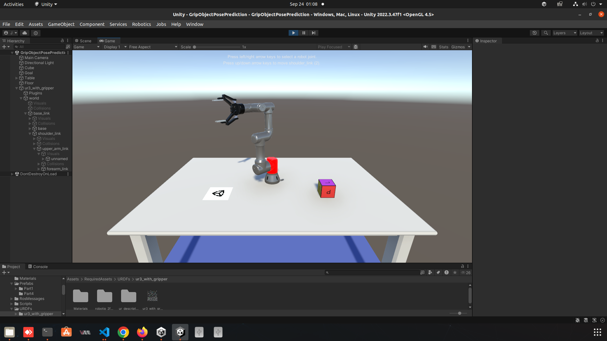
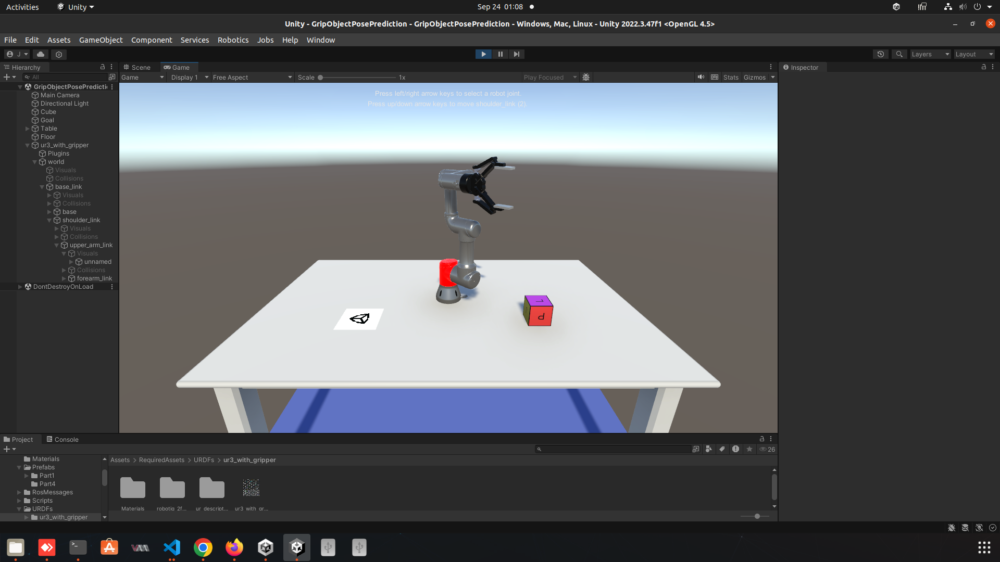

# Robot Arm AI Simulation

UR Robot Arm Deep Learning Driven Tasks with ROS, Unity3D, TensorFlow, PyTorch.

## Project: Grip Object Pose Prediction

Deep Learning with UR3 Robot Arm with ROS & Unity3D for simulation to real world.

Initially, we will manually control UR3 robot arm in Unity3D moving it toward the left and right:

- **Figure 1:** Manually move UR3 toward the left

- **Figure 2:** Manually move UR3 toward the right

We will leverage Domain Randomization for creating a training dataset that we can use to train a deep learning model for Grip Object Pose Prediction.

<!-- ROS URDF -->

## Overview

## Contents

## Dependencies

Unity 3D Packages we use include the following:

- Camera Perception package (1.0.0-preview1)
    - URL: https://github.com/Unity-Technologies/com.unity.perception.git
    - Git URL Import Package: https://github.com/Unity-Technologies/com.unity.perception.git?path=/com.unity.perception#1.0.0-preview.1

- URDF Importer package (v0.2.0-light)
    - URL: https://github.com/Unity-Technologies/URDF-Importer.git
    - Git URL Import Package: https://github.com/Unity-Technologies/URDF-Importer.git?path=/com.unity.robotics.urdf-importer#v0.2.0-light

- ROS TCP Connector package (v0.2.0-light)
    - URL: https://github.com/Unity-Technologies/ROS-TCP-Connector.git
    - Git URL Import Package: https://github.com/Unity-Technologies/ROS-TCP-Connector.git?path=/com.unity.robotics.ros-tcp-connector#v0.2.0-light

## How to Run the Demo

## Resources

- Robotics Development: ROS, Unity3D, DL & DevOps Tools (Tutorial Series): https://youtube.com/playlist?list=PLB8VXMjsTRoue4aodor1lDyZhFTKEP58i&si=e_JukXpAezD40sQt