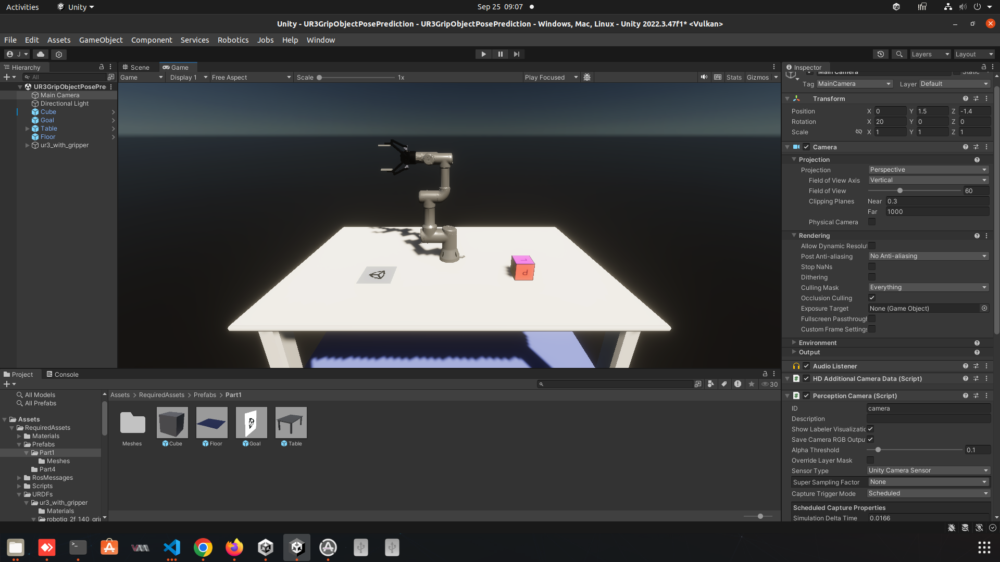

# Robot Arm AI Simulation

UR Robot Arm Deep Learning Driven Tasks with ROS, Unity3D, TensorFlow, PyTorch.

## Project: Grip Object Pose Prediction

Deep Learning with UR3 Robot Arm with ROS & Unity3D for simulation to real world.

### [DEPRECATED: Universal 3D Unity Project Approach]

Initially, we will manually control UR3 robot arm in Unity3D Universal 3D Render Pipeline moving it toward the left and right:

- **Figure 1:** Manually move UR3 toward the left

- **Figure 2:** Manually move UR3 toward the right

We will leverage Domain Randomization for creating a training dataset that we can use to train a deep learning model for Grip Object Pose Prediction.

### Transitioning to HD Universal 3D Unity Project Approach

Initially, we will manually control UR3 robot arm in Unity3D HD Universal 3D Render Pipeline moving it toward the left and right:

- **Figure 1:** Manually move UR3 toward the left or right

<!-- ROS URDF -->

## Overview

## Contents

## Dependencies

Unity 3D Packages we use include the following:

- Camera Perception package (1.0.0-preview1)
    - URL: https://github.com/Unity-Technologies/com.unity.perception.git
    - Git URL Import Package: https://github.com/Unity-Technologies/com.unity.perception.git?path=/com.unity.perception#1.0.0-preview.1

- URDF Importer package (v0.2.0-light)
    - URL: https://github.com/Unity-Technologies/URDF-Importer.git
    - Git URL Import Package: https://github.com/Unity-Technologies/URDF-Importer.git?path=/com.unity.robotics.urdf-importer#v0.2.0-light

- ROS TCP Connector package (v0.2.0-light)
    - URL: https://github.com/Unity-Technologies/ROS-TCP-Connector.git
    - Git URL Import Package: https://github.com/Unity-Technologies/ROS-TCP-Connector.git?path=/com.unity.robotics.ros-tcp-connector#v0.2.0-light

The following two URDF and ROS TCP latest Unity3D packages resulted in error after importing RequiredAssets:

- `Scripts/TrajectoryPlanner.cs (16,13): error CS0246: The type or namespace name "ROSConnection" could not be found`

- URDF Importer package (v0.5.2)
    - Git URL Import Package: https://github.com/Unity-Technologies/URDF-Importer.git?path=/com.unity.robotics.urdf-importer#v0.5.2

- ROS TCP Connector package (v0.7.0)
    - Git URL Import Package: https://github.com/Unity-Technologies/ROS-TCP-Connector.git?path=/com.unity.robotics.ros-tcp-connector#v0.7.0

## How to Run the Demo

### Setup ROS Unity Docker Dev Environment

For more steps on setting up the ROS Unity Docker development enviornment, refer to our guide: [0_setup_ros_docker.md](./docs/0_setup_ros_docker.md)

<!-- ### Build ROS Docker Image & Launch Docker Container  -->

<!-- Download the assets from the "Robotics Development: ROS, Unity3D, DL & DevOps Tools (Tutorial Series)" resource. -->

<!-- Then run these commands to build the ROS docker image:

~~~bash
cd ~/src/Robot-Arm-AI-Simulation/

# Assuming you downloaded the tutorial assets into our project's folder, navigate to this folder
cd Robotics-Object-Pose-Estimation-main/Robotics-Object-Pose-Estimation

# docker build -t unity-robotics:pose-estimation -f docker/Dockerfile .
docker build -t unity-robotics:pose-estimation -f docker/unity-robotics/Dockerfile .
~~~ -->

<!-- Lauch ROS docker container:

~~~bash
docker run -it --rm -p 10000:10000 -p 5005:5005 unity-robotics:pose-estimation /bin/bash
~~~ -->

<!-- Source ROS workspace:

~~~bash
# After launching docker container, you start in this folder
# root@59f88a544b40:/catkin_ws#
source devel/setup.bash
~~~ -->

<!-- - NOTE: For the "Build ROS Docker Image", I referenced the video tutorial's markdown "Robotics-Object-Pose-Estimation/Documentation/quick_demo_full.md" and their "Set Up the ROS Side" -->

<!-- ### Launch ROS MoveIt in Docker Container

We will run `roslaunch` to start ROS core, set ROS parameters, start server endpoint, start Mover service, start Pose Estimation nodes and launch Moveit:

~~~bash
roslaunch ur3_moveit pose_est.launch
~~~ -->

### Play Unity UR Robot Arm Grip Object Prediction

1\. In Unity, press **play** button.

2\. Click on **Pose Estimation**, so the UR robot arm performs **Grip Object Prediction**,
which results in the UR robot arm grabbing the **cube** and moving it to the desired **goal**
location.

## Resources

- Robotics Development: ROS, Unity3D, DL & DevOps Tools (Tutorial Series): https://youtube.com/playlist?list=PLB8VXMjsTRoue4aodor1lDyZhFTKEP58i&si=e_JukXpAezD40sQt

- For more information on original project, refer to Unity-Technologies - Robotics-Object-Pose-Estimation: https://github.com/Unity-Technologies/Robotics-Object-Pose-Estimation/tree/main
